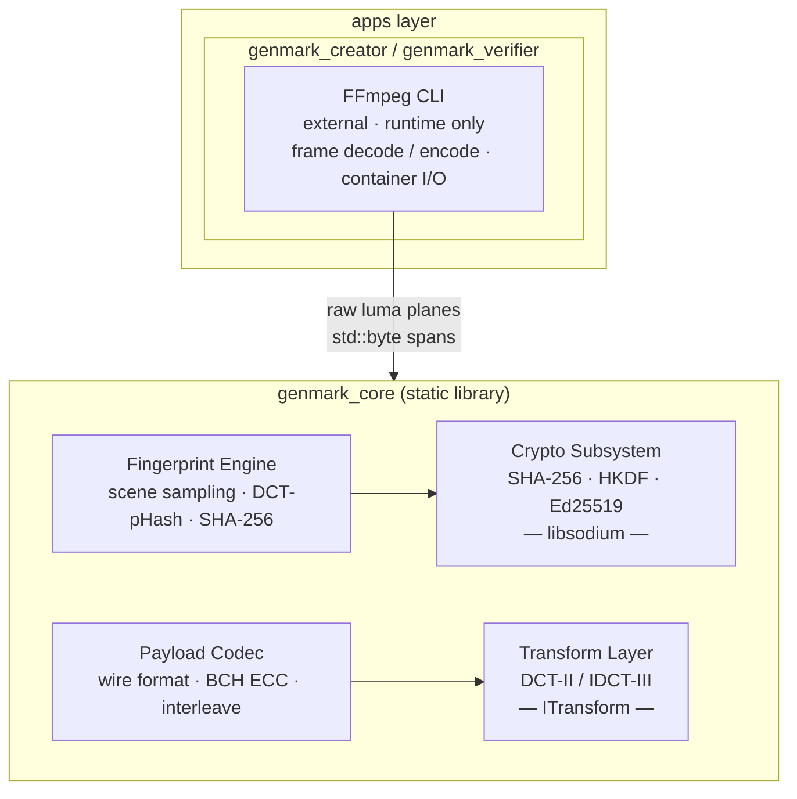
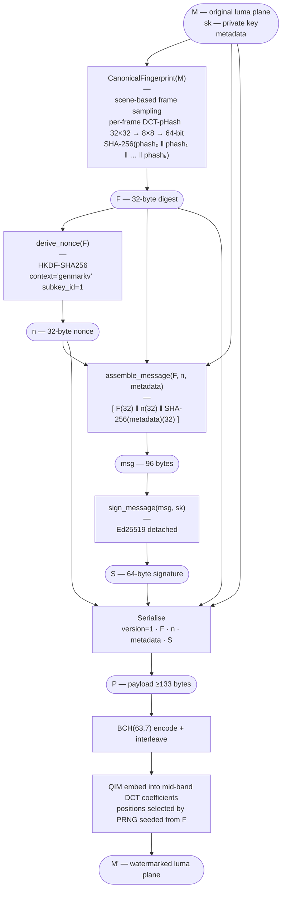
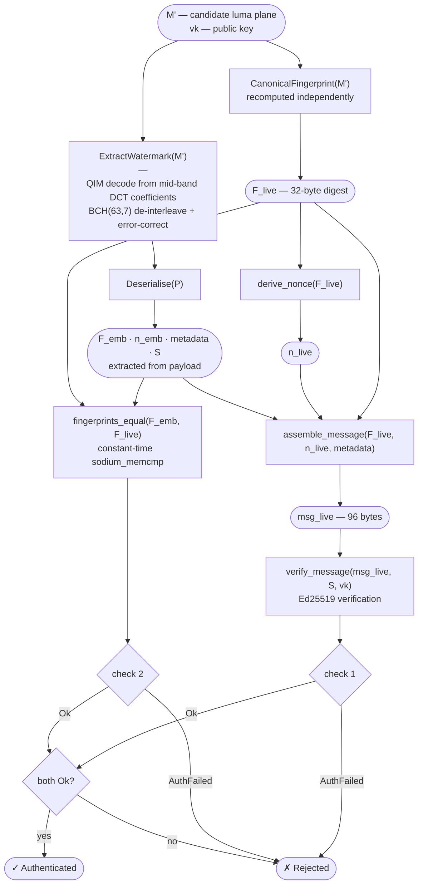
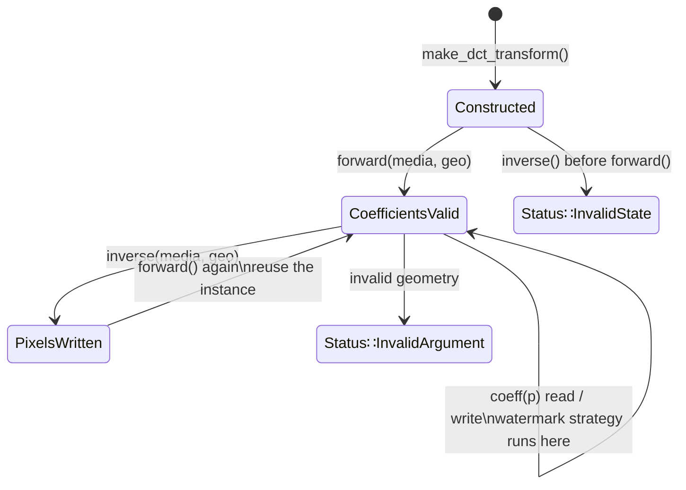
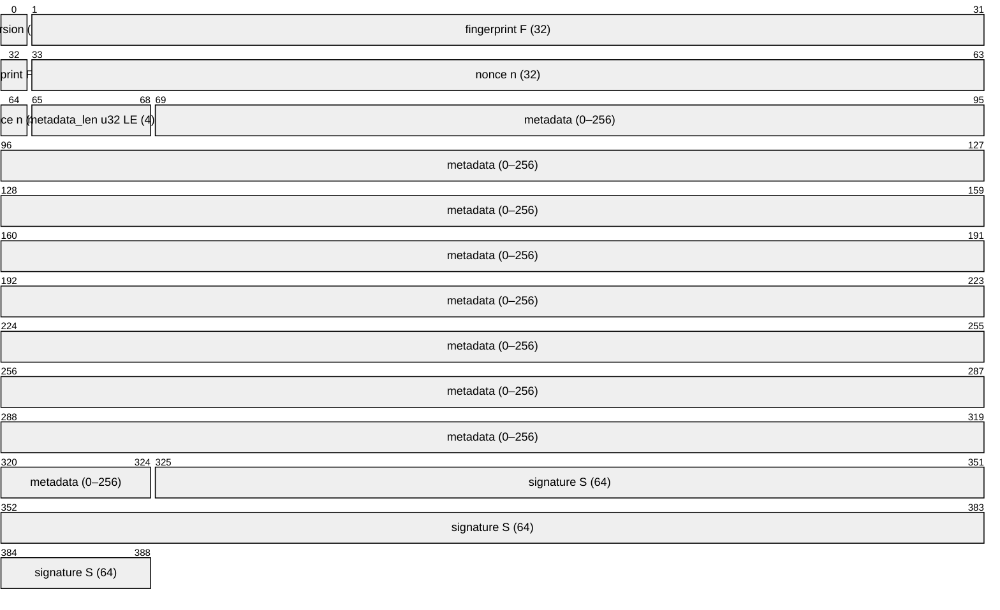

# GenMark — Architecture

> This document describes the structural decomposition of GenMark,
> the data flow through each pipeline, and the contracts between components.

---

## 1. System Purpose

GenMark binds video media to a cryptographic identity. A signer embeds a
watermark payload into a video's frequency-domain coefficients. Any downstream
verifier can extract that payload and determine:

1. That it was produced by the holder of a specific private key.
2. That the visual content has not been substituted since signing.

GenMark is **not** a file-integrity checker. It operates on decoded visual
content, not on encoded bitstreams.

---


## 2. Component Map



---

## 4. Creation Pipeline

The creator takes an original media file and a private signing key and
produces a watermarked media file.



---

## 5. Verification Pipeline

The verifier takes a candidate media file and a public key and returns
authenticated or rejected.



Both checks are mandatory. See `DESIGN.md §4` for why omitting either
one opens a specific attack.

---

## 6. Transform Layer

The transform layer is accessed through `ITransform`. The concrete
implementation is `DCTTransform` (DCT-II over 8×8 luma blocks), returned
by `make_dct_transform()`.

### State machine



### Padding and stride

Frames are not required to be multiples of 8. Partial blocks at the right
and bottom edges are handled by **boundary replication** before the forward
pass. Only visible pixels (`px < geo.width`, `py < geo.height`) are written
back on the inverse pass. The `stride` field in `FrameGeometry` accounts for
FFmpeg's SIMD-alignment padding; reads and writes use `y * geo.stride + x`,
not `y * geo.width + x`.

### Coefficient layout in memory

```
coeffs_[ ((block_row * bcols + block_col) * 8 + u) * 8 + v ]
```

One complete 8×8 block is contiguous. This is cache-friendly for the
per-block access pattern of the watermark strategy.

---

## 7. Cryptographic Subsystem

All cryptographic operations go through `crypto.hpp`. No other component
calls libsodium directly.

### Key types and sizes

| Symbol | Type | Size | Contents |
|---|---|---|---|
| `SecretKey` | move-only class | 64 bytes | seed (32) ‖ public key (32) |
| `PublicKey` | `std::array<uint8_t, 32>` | 32 bytes | Ed25519 public key |
| `Digest` | `std::array<uint8_t, 32>` | 32 bytes | SHA-256 output |
| `Nonce` | `std::array<uint8_t, 32>` | 32 bytes | HKDF-derived nonce |
| `Signature` | `std::array<uint8_t, 64>` | 64 bytes | Ed25519 detached sig |
| `SignedMessage` | `std::array<uint8_t, 96>` | 96 bytes | F ‖ n ‖ SHA-256(meta) |

### libsodium API mapping

| GenMark function | libsodium function |
|---|---|
| `sha256()` | `crypto_hash_sha256()` |
| `derive_nonce()` | `crypto_kdf_derive_from_key()` |
| `sign_message()` | `crypto_sign_detached()` |
| `verify_message()` | `crypto_sign_verify_detached()` |
| `fingerprints_equal()` | `sodium_memcmp()` |
| `SecretKey` destructor | `sodium_memzero()` |

### Initialisation requirement

`crypto_init()` must be called once from the main thread before any other
crypto function. It wraps `sodium_init()` which initialises the system CSPRNG.
Subsequent calls are no-ops. The apps layer is responsible for calling this
at startup.

---

## 8. Payload Wire Format



> Minimum size (no metadata): **133 bytes** · Maximum size (256-byte metadata): **389 bytes**

All multi-byte integers are big-endian unless noted. The `metadata_len`
field is explicitly little-endian to match common platform conventions for
length prefixes.

After serialisation the payload is BCH(63,7) encoded and interleaved before
embedding. The format above describes the logical structure before ECC.

---

## 9. External Dependencies

| Dependency | Role | Link model | Version policy |
|---|---|---|---|
| **libsodium** | All cryptographic primitives | Static (release), shared (dev) | ≥ 1.0.12; ABI assertions in `crypto.cpp` catch mismatches at compile time |
| **FFmpeg** | Frame decode/encode, container I/O | External CLI, not linked | Any version supporting the target codec |
| **stb_image_resize** | Platform-deterministic Lanczos resampling | Bundled in `third_party/` | Pinned; must not be updated without re-validating fingerprint stability |

FFmpeg is deliberately not linked as a library. This avoids codec library
maintenance, static linking complexity, and AV1 encoder dependency management.

---

## 10. Threading Model

- `genmark_core` has no global mutable state after `crypto_init()` returns.
- Each `ITransform` instance owns its own coefficient buffer — instances are
  not shared between threads.
- `SecretKey` is move-only and must not be shared between threads without
  external synchronisation.
- `crypto_init()` is idempotent and safe to call from multiple threads
  (libsodium's `sodium_init()` is internally synchronised).
- The cosine lookup table in `transform.cpp` is a function-local `static`
  initialised once on first call; C++11 guarantees this is thread-safe.